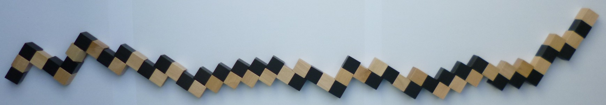

# Cube puzzle

This repo implements a brute-force solver for a wooden puzzle. It consists of a 64 block long snake that should be shaped into a 4x4x4 cube, see image below. ([image source](http://www.dr-karstens.de/snake.html))

The puzzle has (including rotations and mirroring) [192 solutions](solutions.txt). On my machine it took almost 11 minutes to search through 52 million configurations, see these [logs](stats.txt).
